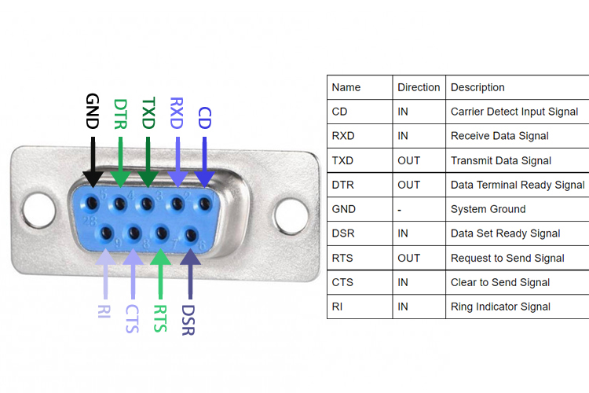

# MAX3232 Protoboard Build Checklist (SIC)

Use this when building your MAX3232 board from loose IC + protoboard.

## MAX3232 DIP-16 Pinout Wiring (Use This First)

| MAX3232 Pin | Signal | Connect To |
|---|---|---|
| 16 | VCC | `+3.3V` (or SIC logic rail in ~3.3-3.6V range) |
| 15 | GND | Common ground (SIC + DB9 + board) |
| 11 | T1IN (TTL in) | `SIC TX` |
| 14 | T1OUT (RS-232 out) | `DB9 pin 2` (PC RX) |
| 13 | R1IN (RS-232 in) | `DB9 pin 3` (PC TX) |
| 12 | R1OUT (TTL out) | `SIC RX` |
| DB9 pin 5 | Ground | Common ground |

### Charge-Pump + Decoupling Capacitors

Recommended values for MAX3232-class parts (use unless your exact datasheet says otherwise):

* `C1 = 0.1uF`
* `C2 = 0.1uF`
* `C3 = 0.1uF`
* `C4 = 0.1uF`
* `VCC decoupler = 0.1uF` (plus optional `1uF` bulk on the board rail)

| Capacitor | Between Pins |
|---|---|
| C1 | `pin 1 (C1+)` and `pin 3 (C1-)` |
| C2 | `pin 4 (C2+)` and `pin 5 (C2-)` |
| C3 | `pin 2 (V+)` and `GND` |
| C4 | `pin 6 (V-)` and `GND` |
| Decoupler | `pin 16 (VCC)` and `pin 15 (GND)` (place close to IC) |

### Stereo Jack Mapping Used in This Repo

| Jack conductor | Signal |
|---|---|
| tip | `SIC TX` (to MAX3232 `pin 11`) |
| center/ring | `SIC RX` (from MAX3232 `pin 12`) |
| base | `GND` |

Critical:

* Do not feed external VCC into SIC serial lines.
* Stop immediately if SIC-facing TTL high looks like ~5V.

## Power Source: Yurobot 545043 (USB 5V -> 3.3V)

Use the Yurobot 545043 module as the dedicated MAX3232 supply.

| Connection | Wire To |
|---|---|
| USB `5V` | `Yurobot VIN` |
| USB `GND` | `Yurobot GND` |
| `Yurobot 3.3V OUT` | `MAX3232 pin 16 (VCC)` |
| `Yurobot GND` | `MAX3232 pin 15 (GND)` + SIC/DB9 common ground |

Preflight checks:

* Measure regulator output at module pins: target ~`3.3V`.
* Verify common ground continuity across regulator, MAX3232, SIC, and DB9 pin 5.
* Verify SIC-facing TTL lines are not near `5V`.

## 1) Parts + Prep

| Item | Check |
|---|---|
| MAX3232 IC (exact variant noted) | ☐ |
| Charge-pump capacitors (per your MAX3232 datasheet) | ☐ |
| 0.1uF decoupling capacitor (VCC to GND, close to IC) | ☐ |
| Protoboard, headers, wire, solder | ☐ |
| Meter (continuity + DC volts) | ☐ |

## 2) Wiring Plan (before solder)

| Side | Signal | Target |
|---|---|---|
| SIC TTL | SIC TX | MAX3232 TTL RX input |
| SIC TTL | SIC RX | MAX3232 TTL TX output |
| SIC TTL | GND | Common ground |
| RS-232 | PC RX path | MAX3232 RS-232 TX output |
| RS-232 | PC TX path | MAX3232 RS-232 RX input |
| RS-232 | GND | Common ground |

DB9 mapping used in this repo:

| DB9 Pin | Function |
|---|---|
| 2 | iCybie -> PC (RX on PC side) |
| 3 | PC -> iCybie (TX on PC side) |
| 5 | Ground |

Stereo jack mapping used in this repo:

| Jack conductor | Function |
|---|---|
| tip | TX |
| center/ring | RX |
| base | GND |

## 3) Assembly Order

| Step | Check |
|---|---|
| Place IC socket/IC orientation mark | ☐ |
| Solder power rails and decoupling cap first | ☐ |
| Solder charge-pump capacitors | ☐ |
| Solder TTL header (`TX`, `RX`, `GND`) | ☐ |
| Solder RS-232 connector wiring | ☐ |
| Label board silkscreen/marker (`TTL`, `RS232`, `GND`) | ☐ |

## 4) Pre-Power Safety Checks

| Check | Pass |
|---|---|
| No short between VCC and GND | ☐ |
| No short between TTL TX/RX and GND | ☐ |
| Continuity from each endpoint to intended pin only | ☐ |
| DB9 pin mapping verified (2/3/5) | ☐ |
| SIC jack mapping verified (tip/center/base) | ☐ |

## 5) Power-On Bench Checks (NOT connected to SIC)

| Measurement | Target |
|---|---|
| VCC at MAX3232 | matches intended supply |
| TTL idle level at SIC-facing TX output | safe 3.3V-domain logic for SIC |
| RS-232 side idle polarity | expected RS-232 negative idle behavior |
| Loopback test | pass at `9600 8N1` |

Stop immediately if SIC-facing TTL looks like 5V logic.

## 6) First SIC Connection (Controlled)

| Step | Check |
|---|---|
| Connect only TX/RX/GND (no VCC feed into SIC serial lines) | ☐ |
| Start with known-good SIC/CROM setup | ☐ |
| Run `validate-link.sh` quick mode | ☐ |
| Observe `U` stream -> keypress -> CROM prompt behavior | ☐ |
| Record run in `results-log.md` | ☐ |

Command:

```bash
./dev/serial-ops-sdk/validate-link.sh --device /dev/ttyUSB0 --path MAX3232
```

## 7) Run Record

| Field | Value |
|---|---|
| Board revision | |
| MAX3232 exact part marking | |
| Capacitor values used | |
| Measured TTL idle voltage | |
| SIC used | |
| Outcome | |
| Notes/fixes | |

## No-CROMINST Recovery Path

If CROMINST is not installed on SIC, `sicburn/sicgrab` serial ops will usually fail to handshake.

Recovery steps:

1. Boot SIC with a CROMINST-capable cartridge/setup.
2. Use terminal at `9600 8N1` and verify repeating `U` stream.
3. Press a key to stop `U` stream and enter CROMINST menu.
4. Run install flow (`I`, then `YES`) and wait for completion.
5. Reboot SIC and rerun quick validation:

```bash
./dev/serial-ops-sdk/validate-link.sh --device /dev/ttyUSB0 --path MAX3232
```

## Photo Aids

| Reference | Image |
|---|---|
| RS-232 concept |  |
| Board connection area |  |
| DB9 pinout |  |
