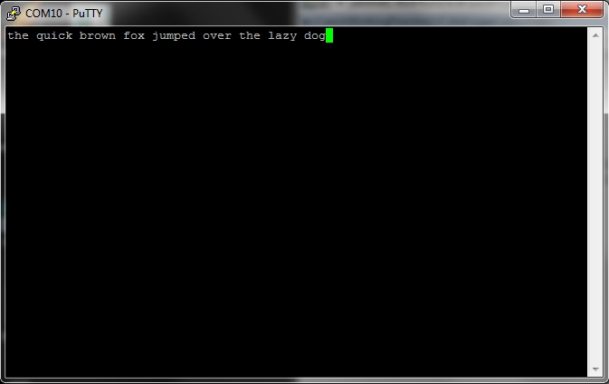

# FT323 vs MAX3232 Comparative (SIC-Specific)

This experiment set compares two connector paths for Super i-Cybie serial access.

| Path | Description |
|---|---|
| `FT323/FT232R` | Direct TTL path (external USB serial adapter) |
| `MAX3232` | Level-shifted RS-232 path (AiboHack-style serial chain) |

This is not a generic test track. It is grounded in project history:

| Source | Relevant finding |
|---|---|
| `ProjectNotes.txt` (2025-10-05) | MAX233A path observed as unsafe due to 5V TTL risk |
| `ProjectNotes.txt` (2025-10-06) | Confirmed cable mapping workflow (`Tx`, `Rx`, `GND`) with continuity and voltmeter |
| `ProjectNotes.txt` (2026-04-17) | FTDI path observed with abnormal fan behavior |
| `docs/RS-232 Installation and Test.pdf` | Serial validation sequence (`9600 8N1`, repeating `U`, keypress to CROMINST prompt) |

## Goal

Select the default SIC connector technology for day-to-day programming and diagnostics.

| Decision axis | Requirement |
|---|---|
| Electrical safety | Safe levels at SIC pins |
| Link behavior | Stable bidirectional serial operation |
| Robot behavior | No side effects (especially fan anomalies) |
| Practicality | Repeatable setup with low bench friction |

## Comparator Definition

| Comparator | Definition |
|---|---|
| Path A | `FT323/FT232R` direct-to-SIC TTL wiring (3.3V logic only; no 5V exposure) |
| Path B | `MAX3232` path via stereo jack/DB9 mapping and RS-232 translation |

## Canonical Validation Signal

Both paths must pass the same SIC handshake test from CROMINST context:

1. SIC sends repeating `U` bytes at `9600 8N1`.
2. Host keypress stops `U` stream.
3. CROMINST command prompt appears.

Only runs that pass all 3 are considered valid for comparison.

## Files

| File | Purpose |
|---|---|
| `MAX3232-protoboard-build.md` | Pin-by-pin build and bring-up checklist for MAX3232 protoboard |
| `test-protocol.md` | Exact per-run steps and fail gates |
| `results-log.md` | Structured run capture with SIC-specific observations |
| `decision.md` | Evidence summary and path recommendation |

## Tooling Pipeline

| Location | Purpose |
|---|---|
| `../../dev/serial-ops-sdk/README.md` | Extracted SDK serial code map + upstream pin |
| `../../dev/serial-ops-sdk/RUNBOOK.md` | Repeatable Linux run workflow |
| `../../dev/serial-ops-sdk/validate-link.sh` | Quick/full link validation for FT323 vs MAX3232 sessions |
| `../../dev/serial-ops-sdk/sync-from-sdk.sh` | Refresh copied files from sibling `../sdk` repo |

## Photo References

Use these during bench setup to reduce wiring mistakes:

| Reference | Image |
|---|---|
| SIC internal connection layout |  |
| On-board serial connection area |  |
| FT232RL reference board |  |
| TTL cable orientation reference |  |
| RS-232 DB9 pinout |  |
| Prior ops bench reference |  |
